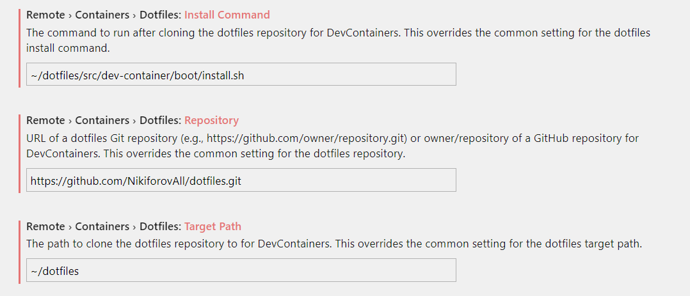

# Repository Development Containers 


## .NET Core dev-container 📦

Summary: .NET Core SDK, zsh + oh-my-zsh / bash.

Please see: [dotnet/README.md](https://github.com/NikiforovAll/dev-containers/tree/master/containers/dotnet)

```json
    {
        "name": "NikiforovAll: .NET Core dev-container",
        "image": "ghcr.io/nikiforovall/devcontainers/dotnet:latest",
        "settings": {
            "terminal.integrated.shell.linux": "/bin/zsh"
        },
    }
```

## Angular dev-container 📦

Summary: Nodejs, Typescript, Angular, zsh + oh-my-zsh / bash.

Please see: [angular/README.md](https://github.com/NikiforovAll/dev-containers/tree/master/containers/angular)

```json
    {
        "name": "NikiforovAll: Angular dev-container",
        "image": "ghcr.io/nikiforovall/devcontainers/angular:latest",
        "settings": {
            "terminal.integrated.shell.linux": "/bin/zsh"
        },
    }
```

## Exercism dev-container 📦

Summary: This is a dev environment with exercism preinstalled.

Please see: [angular/README.md](https://github.com/NikiforovAll/dev-containers/tree/master/containers/exercism)

```json
    {
        "name": "NikiforovAll: Exercism",
        "image": "ghcr.io/nikiforovall/devcontainers/exercism:latest",
        "settings": {
            "terminal.integrated.shell.linux": "/bin/zsh"
        },
        "postCreateCommand": "dotnet restore",
        "workspaceFolder": "/root/home/exercism",
        "workspaceMount": "source=${localWorkspaceFolder}/,target=/root/home/exercism,type=bind,consistency=cached",
        "remoteUser": "root"
    }
```

## Dotfiles

Containers above provide basis and dependencies for dotfiles [https://github.com/NikiforovAll/dotfiles/tree/master/src/dev-container](https://github.com/NikiforovAll/dotfiles/tree/master/src/dev-container)

Configure it like this:

```text
~/dotfiles/src/dev-container/boot/install.sh
https://github.com/NikiforovAll/dotfiles.git
~/dotfiles
```



## Highlights

* Every container is based on common setup that includes:
  * themed bash, zsh. This depends on dotfiles.
  * fzf ⭐
  * fd
  * silversearcher-ag, could be invoked as ag.
  * lnav
  * exa, aliased as ll.

If you use my dotfiles, please see <https://github.com/NikiforovAll/dotfiles/tree/master/src/dev-container/shell> for more details.

## Known issues

* exa requires locale, but dev container doesn't have it. "Unable to determine time zone: No such file or directory (os error 2)"
* [MAJOR] non-root user scenario is not tested
* exercism image builds with some errors

🚧 WIP, Tool chain could be improved based on official impl <https://github.com/NikiforovAll/vscode-dev-containers/tree/nikiforovall-dotnet/containers/nikiforovall-dotnet>

> Consider to replicate dev-container definition as soon as tooling is available and it is possible to build dev-container out of definition, for now. Let's keep dev-container definition in original repo as fork.

## License

Licensed under the MIT License. See [LICENSE](./LICENSE)
